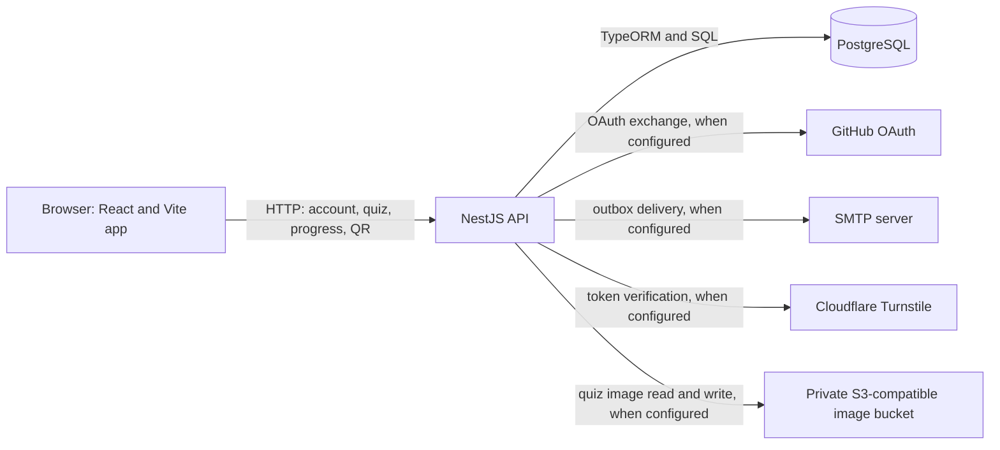

# System architecture

This page describes the runtime and source boundaries visible in this
repository. It does not assert the state of a live deployment. Begin with the
[root README](../README.md) for local setup.

## Runtime units

The frontend composes lazy routes in
[`AppRoutes.tsx`](../frontend/src/routes/AppRoutes.tsx). `courses/` owns course
content and assignment registries; `features/` owns reusable product areas. The
API starts in [`main.ts`](../backend/src/main.ts), applies HTTP protections in
[`create-app.ts`](../backend/src/create-app.ts), and wires modules in
[`app.module.ts`](../backend/src/app.module.ts). The account controllers and
stores live in `accounts/`, although
[`AnalyticsModule`](../backend/src/analytics/analytics.module.ts) currently
wires both account and analytics providers. This is module wiring, not data
ownership.

PostgreSQL is the configured runtime store for quiz entities, account and
session records, mail intents, QR aggregation, and shared request state.
[`TypeOrmPostgresOptions.ts`](../backend/src/db/TypeOrmPostgresOptions.ts),
[`account.store.ts`](../backend/src/accounts/store/account.store.ts), and
[`analytics.store.ts`](../backend/src/analytics/analytics.store.ts) show the
respective ownership. The local Compose file provides PostgreSQL only. The
outbox worker is part of the backend process; there is no separate worker or
Redis service in this repository's current configuration.

## A coursework progress request

1. The browser creates or retrieves a client ID from `localStorage` in
   [`useClientId.ts`](../frontend/src/hooks/useClientId.ts). The
   [active course configuration](../frontend/src/courses/catalog/activeCourses.ts)
   currently uses the same `clientId` key for every course.
2. [`ProgressProvider.tsx`](../frontend/src/context/ProgressProvider.tsx) calls
   [`quiz-progress.ts`](../frontend/src/api/quiz-progress.ts) to load or change
   completion state through `/quizzes/progress`.
3. The API's [`quiz.controller.ts`](../backend/src/quiz/api/quiz.controller.ts)
   validates the request and uses the quiz service and repository for
   PostgreSQL-backed progress. The frontend applies an optimistic update and
   restores its prior state if a mutation fails.

The client ID is independent of the opaque account session. The API must not
assume it authenticates a person. The
[assessment standard](quiz-assessment-standard.md) also distinguishes
browser-delivered practice assessments from protected graded assessments.

## Data and background work

| Data                                              | Authority                                   | How it changes                                                                        |
| ------------------------------------------------- | ------------------------------------------- | ------------------------------------------------------------------------------------- |
| Course definitions and static practice questions  | Versioned frontend source in `courses/`     | Code and content review; practice answers are bundled with the client                 |
| Legacy quiz questions, answers, and progress      | PostgreSQL via `quiz/`                      | Quiz endpoints and migrations; progress is keyed by client ID, app ID, and course ID  |
| Account identity, sessions, and security activity | PostgreSQL via `accounts/` and `analytics/` | Account endpoints, session revisions, and audit writes                                |
| Confirmation and reset mail                       | PostgreSQL outbox until delivery            | An account transaction queues mail; the backend worker claims due rows and calls SMTP |
| Quiz images                                       | Private S3-compatible bucket                | The API stores normalized images and serves them through `/uploads/*`                 |

The quiz progress key is visible in
[`quiz-progress.repository.ts`](../backend/src/quiz/repository/quiz-progress.repository.ts).
For email, [`AuthMailService`](../backend/src/accounts/auth-mail.ts) inserts the
token record and outbox row within the caller's transaction. Its interval worker
claims rows with PostgreSQL `SKIP LOCKED`, then sends through SMTP when
configured. Delivery is asynchronous and may retry; a successful registration
response does not prove that an email was delivered. The
[account guide](owner-account-analytics.md) describes retention and recovery.

## Account and security boundary

Browser account requests go through
[`owner-api.ts`](../frontend/src/features/account/owner-api.ts) to
`/api/account/*`; `/api/owner/*` is a compatibility alias. The backend checks
stored account roles and session revisions. Sessions use opaque HttpOnly
cookies; mutations also require an accepted Origin. The separate admin API key
protects coursework administration endpoints and does not grant an account role.
See [API contracts and security](api-contract-and-security.md) and
[accounts and analytics](owner-account-analytics.md) for the contracts and
configuration names.

For password sign-in,
[`OwnerController`](../backend/src/accounts/owner.controller.ts) passes
validated input to the analytics/account access services. They enforce request
budgets, an accepted Origin, and a Turnstile proof when configured. A successful
sign-in sets a one-hour session cookie; an enrolled account instead receives a
short-lived MFA challenge cookie until a valid second factor is submitted. The
account store checks the database role and session revision on protected
requests. An unavailable runtime store stops account access and request
throttling rather than granting unaudited access.

GitHub OAuth, SMTP, Turnstile, MFA enrollment, and private quiz image storage
depend on server configuration. Their repository implementations do not prove
that a given deployment has them enabled. Do not put server secrets in `VITE_`
variables: the frontend bundle exposes those values. The
[provider](account-providers.md), [MFA](account-mfa.md),
[Turnstile](cloudflare-turnstile.md), and [image](quiz-image-storage.md) guides
cover those boundaries in detail.

## Build and release configuration

Vite builds the frontend; Nest builds the backend. The repository's
[`frontend/vercel.json`](../frontend/vercel.json) defines frontend headers,
rewrites, and build settings. The [`Procfile`](../Procfile) defines Heroku's
account migration release hook and web process. The frontend CI workflows under
[`.github/workflows/`](../.github/workflows/) run checks and offer a manual
production build. These files describe intended deployment behavior; verify the
active environment before drawing conclusions about live services.
