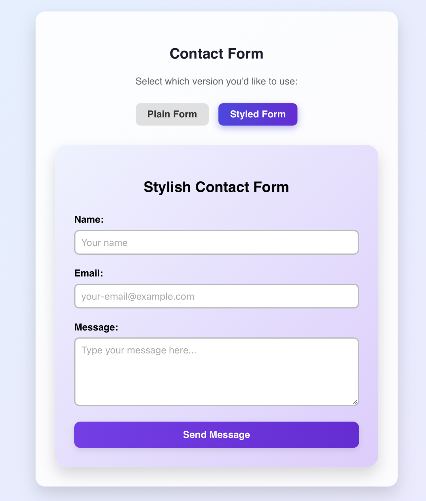

# Module 11A – React Contact Form

## Description

This project is an assignment for CS81 – JavaScript Programming (Summer 2025).  
It features a responsive and interactive contact form built with **React**, supporting form switching, field validation, basic routing, and a scroll-aware footer.

## Features

- Two contact form components:
  - `ContactForm` (minimal)
  - `StyledContactForm` (animated, styled)
- Input fields for name, email, and message
- Field validation for required fields and email format
- Submitted data preview using `JSON.stringify`
- Optional clearing of form after submission
- Button-based form selection with hover effects
- **Confetti animation** on successful submission (`canvas-confetti`)
- React Router navigation between Home and Contact pages
- Smooth reveal of footer only when scrolling up at bottom of page

## What I Learned

- React fundamentals: `useState`, event handling, conditional rendering
- Basic form validation and controlled components
- Styling in React using inline styles and hover effects
- Layout and design using Flexbox and responsive units
- Dynamic navigation with `react-router-dom`
- Component-based organization of a React project

---

## Screenshot

<details>
  <summary>Click to expand view of project structure</summary>



</details>

---

## Getting Started

1. **Clone the repository**

```bash
git clone https://github.com/sergehall/cs81-module11-form
cd cs81-module11-form
```

2. **Install dependencies**

```bash
npm install
```

3. **Run the development server**

```bash
npm run dev
```

---

## Repository Structure

```
.
├── public/
├── src/
│   ├── assets/
│   ├── components/
│   │   ├── ContactForm.jsx
│   │   ├── StyledContactForm.jsx
│   │   └── Footer.jsx
│   ├── pages/
│   │   ├── ContactFormPage.jsx
│   │   ├── Contact.jsx
│   │   └── Home.jsx
│   ├── App.jsx
│   ├── App.css
│   ├── index.css
│   └── main.jsx
├── index.html
├── vite.config.js
├── package.json
├── .gitignore
└── README.md
```

---

## License

This project is for educational purposes only and part of coursework for **Santa Monica College – CS81 (Summer 2025)**.
