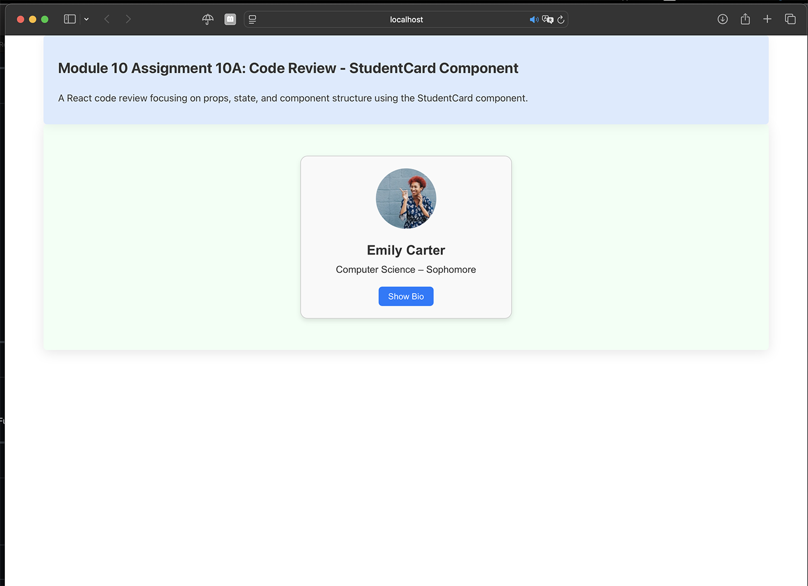

# Module 10A – StudentCard Code Review

## Description

This is a React code review assignment for CS81 – JavaScript Programming.  
The task involved analyzing a pre-written `StudentCard` component and adding inline comments to explain the logic behind **props**, **state**, and **interactivity** using `useState`.

The component renders student profile cards with an image, name, major, year, and a toggleable biography section.

## What I Learned

- How props are used to pass data like `name`, `bio`, `imageUrl` from a parent to a child component
- How state (`useState`) can control UI behavior (like toggling bio visibility)
- How to write meaningful inline comments to explain JSX logic
- How to improve readability and maintainability in React components

---

## Commented Code

The original standalone assignment package is available as [a ZIP archive](module10a-studentcard-review.zip). It includes the commented `StudentCard.jsx` component and its original project structure. The web platform does not expose that archive's `src/` files as separate links.

---

## Screenshot

  
 Click to view screenshot with comments

Below is a screenshot showing the `StudentCard` running in the browser, along with inline comments explaining how props, state, and toggle functionality work:

---

## Using this material in the current repository

This README accompanies an archived course assignment. To run the current coursework application, follow the [platform README](../../../../../../README.md). To run the historical standalone exercise, download the ZIP archive above and follow its own project files.

## License

This project is for educational use only as part of Santa Monica College's CS81 coursework.
